# AI-Powered Tropical Cyclone Intelligence & Forecasting Platform
## Complete System Architecture, End-to-End Data Flow, Model Pipeline & Technical USPs

**Document Status:** Production Research & Engineering Architecture Specification  
**System Title:** AI-Powered Tropical Cyclone Intelligence & Forecasting System  
**System Subtitle:** Multi-Modal Satellite Intelligence + Spatio-Temporal AI + Forecasting + Risk Analysis + Explainable Decision Support  
**Domain Focus:** North Indian Ocean Basin (Bay of Bengal & Arabian Sea)  

---

# 1. Executive System Overview

The **Cyclone AI Platform** is an end-to-end, research-grade meteorological intelligence platform that ingests multi-spectral Earth observation satellite data, historical best-tracks, and atmospheric thermodynamic soundings to deliver real-time cyclone detection, intensity estimation, trajectory forecasting, cyclogenesis probability assessment, and explainable decision support.

The system is organized into a strictly tiered, 11-stage architectural hierarchy:

```text
┌─────────────────────────────────────────────────────────────────────────────┐
│ 1. HETEROGENEOUS DATA SOURCES (INSAT-3D, TCIR, MOSDAC, ERA5, IBTrACS)       │
└──────────────────────────────────────┬──────────────────────────────────────┘
                                       ▼
┌─────────────────────────────────────────────────────────────────────────────┐
│ 2. DYNAMIC DATA INGESTION LAYER (Live Operations vs Historical Replay)      │
└──────────────────────────────────────┬──────────────────────────────────────┘
                                       ▼
┌─────────────────────────────────────────────────────────────────────────────┐
│ 3. QUALITY CONTROL, SATELLITE PREPROCESSING & TENSOR CONSTRUCTION           │
└──────────────────────────────────────┬──────────────────────────────────────┘
                                       ▼
┌─────────────────────────────────────────────────────────────────────────────┐
│ 4. MULTI-MODAL FEATURE ENGINEERING (Spatial, Kinematic, Thermodynamic)      │
└──────────────────────────────────────┬──────────────────────────────────────┘
                                       ▼
┌─────────────────────────────────────────────────────────────────────────────┐
│ 5. AI/ML MULTI-MODEL INTELLIGENCE LAYER (ResNet-18, Temporal LSTM, RF)      │
└──────────────────────────────────────┬──────────────────────────────────────┘
                                       ▼
┌─────────────────────────────────────────────────────────────────────────────┐
│ 6. PREDICTION ENGINE & RELIABILITY FALLBACK (Climatology Fallback)          │
└──────────────────────────────────────┬──────────────────────────────────────┘
                                       ▼
┌─────────────────────────────────────────────────────────────────────────────┐
│ 7. VALIDATION & UNCERTAINTY QUANTIFICATION (Haversine Backtesting, C.I.)   │
└──────────────────────────────────────┬──────────────────────────────────────┘
                                       ▼
┌─────────────────────────────────────────────────────────────────────────────┐
│ 8. RISK ASSESSMENT & EARLY WARNING ENGINE (Impact Zones & Threat Levels)    │
└──────────────────────────────────────┬──────────────────────────────────────┘
                                       ▼
┌─────────────────────────────────────────────────────────────────────────────┐
│ 9. DISTRIBUTED BACKEND & MONGODB STORAGE (Express Orchestrator + MongoDB)   │
└──────────────────────────────────────┬──────────────────────────────────────┘
                                       ▼
┌─────────────────────────────────────────────────────────────────────────────┐
│ 10. INTERACTIVE USER INTERFACES & RAG CHATBOT (React/Vite + Gemini/Pinecone)│
└─────────────────────────────────────────────────────────────────────────────┘
```

---

# 2. End-to-End Visual System Architecture Diagram

```mermaid
flowchart TD
    %% COLOR DEFINITIONS AS PER SPECIFICATION
    %% Blue: Data Sources & Ingestion
    %% Purple: Processing & Feature Engineering
    %% Orange: AI/ML Intelligence & Models
    %% Green: Validation & Continuous Feedback
    %% Red: Risk & Alerts
    %% Dark Gray: Backend & Database
    %% Light Gray: Frontend & Chatbot

    classDef dataClass fill:#1e3a8a,stroke:#3b82f6,stroke-width:2px,color:#ffffff;
    classDef procClass fill:#581c87,stroke:#a855f7,stroke-width:2px,color:#ffffff;
    classDef mlClass fill:#7c2d12,stroke:#f97316,stroke-width:2px,color:#ffffff;
    classDef valClass fill:#064e3b,stroke:#10b981,stroke-width:2px,color:#ffffff;
    classDef riskClass fill:#7f1d1d,stroke:#ef4444,stroke-width:2px,color:#ffffff;
    classDef backendClass fill:#1f2937,stroke:#4b5563,stroke-width:2px,color:#ffffff;
    classDef uiClass fill:#0f172a,stroke:#38bdf8,stroke-width:2px,color:#ffffff;
    classDef fallbackClass fill:#78350f,stroke:#f59e0b,stroke-width:2px,stroke-dasharray: 5 5,color:#ffffff;

    subgraph SEC1 ["1. HETEROGENEOUS DATA SOURCES"]
        TCIR["TCIR Archive<br/>(4-Channel Benchmark HDF5/ir.npy)"]:::dataClass
        MOSDAC["ISRO MOSDAC Live Data<br/>(INSAT-3D / 3DR / 3DS L1B)"]:::dataClass
        IBTRACS["NOAA IBTrACS NIO Database<br/>(1842-2024 Historical Tracks)"]:::dataClass
        ERA5["Atmospheric Soundings / ERA5<br/>(SST, Shear, RH, Vorticity, MSLP)"]:::dataClass
    end

    subgraph SEC2 ["2. DYNAMIC INGESTION & SCHEDULING LAYER"]
        INGEST["SatelliteDataProvider Abstraction<br/>(ML/ingestion/provider_base.py)"]:::dataClass
        ROUTER{"Mode Router<br/>(satellite_repository.py)"}:::dataClass
        CRON["Synoptic Cron Scheduler<br/>(00, 06, 12, 18 UTC Ticks)"]:::dataClass
        LIVE_MODE["Live Mode Ingestion<br/>(mosdac_provider.py)"]:::dataClass
        REPLAY_MODE["Historical Replay Ingestion<br/>(tcir_provider.py)"]:::dataClass
    end

    TCIR --> INGEST
    MOSDAC --> INGEST
    INGEST --> ROUTER
    CRON -.->|Triggers| ROUTER
    ROUTER -->|Live Operational| LIVE_MODE
    ROUTER -->|Historical Validation| REPLAY_MODE

    subgraph SEC3 ["3. QUALITY CONTROL & PREPROCESSING PIPELINE"]
        QC["Data Validation & Quality Filtering<br/>(Missing/Corrupt Frame Detection)"]:::procClass
        ALIGN["Spatio-Temporal Alignment<br/>(7° Storm Centered Crop / 201x201)"]:::procClass
        NORM["Radiometric Calibration & Normalization<br/>(Kelvin Conversion / Min-Max Scaling)"]:::procClass
        TENSOR["Multi-Channel Tensor Assembly<br/>[B, C, 201, 201] (IR, WV, VIS, PMW)"]:::procClass
    end

    LIVE_MODE --> QC
    REPLAY_MODE --> QC
    QC --> ALIGN --> NORM --> TENSOR

    subgraph SEC4 ["4. MULTI-MODAL FEATURE ENGINEERING"]
        FEAT_SAT["Satellite Morphology Features<br/>(CDO Eyewall, Cloud-Top Temp, Convective Bands)"]:::procClass
        FEAT_KIN["Kinematic Trajectory Features<br/>(Lat, Lon, Heading Vector, Forward Speed, Delta-Fix)"]:::procClass
        FEAT_ENV["Thermodynamic Sounding Features<br/>(SST ≥ 26.5°C, VWS ≤ 15kts, 700hPa RH, Vorticity)"]:::procClass
        FEAT_HIST["Historical Climatology Features<br/>(Analogous Storm Tracks & Seasonal Genesis Rates)"]:::procClass
        FUSION["Multi-Modal Cyclone State Vector<br/>Z = [F_sat ⊕ F_kin ⊕ F_env ⊕ F_hist]"]:::procClass
    end

    TENSOR --> FEAT_SAT
    IBTRACS --> FEAT_KIN
    IBTRACS --> FEAT_HIST
    ERA5 --> FEAT_ENV
    FEAT_SAT --> FUSION
    FEAT_KIN --> FUSION
    FEAT_ENV --> FUSION
    FEAT_HIST --> FUSION

    subgraph SEC5 ["5. AI/ML MULTI-MODEL INTELLIGENCE SUITE"]
        DET_MODEL["1. Disturbance Detector<br/>(Thermal Threshold + Gradient Scan)"]:::mlClass
        INT_MODEL["2. Intensity Regressor (ResNet-18)<br/>(ML/training/src/models/intensity_regressor.py)"]:::mlClass
        TRK_MODEL["3. TrackForecaster (Temporal LSTM)<br/>(ML/training/src/models/temporal_lstm.py)"]:::mlClass
        GEN_MODEL["4. Cyclogenesis Classifier (Calibrated RF)<br/>(ML/training/train_cyclogenesis.py)"]:::mlClass
        CLIM_FALLBACK["5. Climatology Fallback Engine<br/>(backend/src/services/fallbackService.js)"]:::fallbackClass
    end

    FUSION --> DET_MODEL
    TENSOR --> INT_MODEL
    FUSION --> TRK_MODEL
    FEAT_ENV --> GEN_MODEL
    QC -.->|On Ingestion/Model Timeout| CLIM_FALLBACK

    subgraph SEC6 ["6. PREDICTION ENGINE & UNCERTAINTY QUANTIFICATION"]
        ENGINE["Unified Prediction Engine<br/>(ML/serving/app/services/prediction_engine.py)"]:::mlClass
        INT_PRED["Intensity Estimate<br/>(Wind Speed km/h ± 12km/h 90% CI)"]:::mlClass
        TRK_PRED["Multi-Horizon Trajectory<br/>(+6h, +12h, +24h, +48h Projections)"]:::mlClass
        GEN_PRED["Cyclogenesis Probability<br/>(48h Risk %, Dominant Environmental Driver)"]:::mlClass
        UNCERT["Uncertainty Quantification<br/>(Expanding Haversine Error Radii: 38km to 185km)"]:::mlClass
    end

    INT_MODEL --> ENGINE
    TRK_MODEL --> ENGINE
    GEN_MODEL --> ENGINE
    CLIM_FALLBACK -.->|Fallback Data| ENGINE
    ENGINE --> INT_PRED
    ENGINE --> TRK_PRED
    ENGINE --> GEN_PRED
    ENGINE --> UNCERT

    subgraph SEC7 ["7. VALIDATION & SCIENTIFIC BACKTESTING"]
        BACKTEST_SUITE["Empirical Backtesting Engine<br/>(ML/evaluation/backtest_suite.py)"]:::valClass
        METRICS_TRK["Track Metrics (Haversine Error)<br/>+6h: 76.8km | +12h: 149.5km | +24h: 305.8km"]:::valClass
        METRICS_INT["Intensity Metrics<br/>MAE: 8.38 km/h | Category Accuracy: 83.98%"]:::valClass
        METRICS_GEN["Cyclogenesis Validation<br/>ROC-AUC: 0.8176 | Brier Score: 0.1690"]:::valClass
    end

    TRK_PRED --> BACKTEST_SUITE
    INT_PRED --> BACKTEST_SUITE
    GEN_PRED --> BACKTEST_SUITE
    IBTRACS -.->|Ground Truth Comparison| BACKTEST_SUITE
    BACKTEST_SUITE --> METRICS_TRK
    BACKTEST_SUITE --> METRICS_INT
    BACKTEST_SUITE --> METRICS_GEN
    BACKTEST_SUITE -.->|Continuous Feedback Loop| INT_MODEL
    BACKTEST_SUITE -.->|Continuous Feedback Loop| TRK_MODEL

    subgraph SEC8 ["8. RISK & DECISION SUPPORT LAYER"]
        RISK_ENG["Risk Assessment Engine<br/>(backend/src/controllers/cyclone.controller.js)"]:::riskClass
        IMPACT_ZONES["Coastal Impact & Risk Zones<br/>(Wind Swath, Landfall Point, Storm Surge Threat)"]:::riskClass
        DYNAMIC_TREND["Dynamic Intensity Trend<br/>(Rapid Intensification, Steady, Frictional Decay)"]:::riskClass
        EARLY_WARN["Early Warning Advisory<br/>(IMD Category Classification: CS, SCS, VSCS, Super)"]:::riskClass
    end

    INT_PRED --> RISK_ENG
    TRK_PRED --> RISK_ENG
    UNCERT --> RISK_ENG
    RISK_ENG --> IMPACT_ZONES
    RISK_ENG --> DYNAMIC_TREND
    RISK_ENG --> EARLY_WARN

    subgraph SEC9 ["9. DISTRIBUTED BACKEND & METADATA STORAGE"]
        EXPRESS["Node.js / Express Orchestrator (:5000)<br/>(backend/src/server.js)"]:::backendClass
        BREAKER["Circuit Breakers & Retries<br/>(Opossum Breakers & Fail-Safe Routing)"]:::backendClass
        MONGO[("MongoDB Database (:27017)<br/>Predictions, Storms, Provenance, TrackPoints")]:::backendClass
        RAG_VEC[("Pinecone Vector DB<br/>Meteorological Document Embeddings")]:::backendClass
        GEMINI["Google Gemini LLM<br/>Domain-Grounded Context Synthesis"]:::backendClass
    end

    ENGINE --> EXPRESS
    RISK_ENG --> EXPRESS
    EXPRESS --> BREAKER
    EXPRESS --> MONGO
    EXPRESS <--> RAG_VEC
    EXPRESS <--> GEMINI

    subgraph SEC10 ["10. USER INTERFACES & AI CHATBOT"]
        NAV["Mode Switcher & Status Bar<br/>[ 🟢 Live Mode | ⏱️ Replay Mode ]"]:::uiClass
        MAP_VIEW["Geospatial Interactive Map<br/>(Observed Track vs Forecast vs Uncertainty Cone)"]:::uiClass
        SAT_VIEW["Multi-Spectral Satellite Viewer<br/>(Thermal IR, Dvorak BD-Curve, Water Vapor)"]:::uiClass
        TREND_VIEW["Dynamic Trend & Category Panel<br/>(Delta-V Forecast & Calibrated Confidence Interval)"]:::uiClass
        CHAT_UI["Conversational RAG Assistant<br/>(Natural Language Cyclone Decision Support)"]:::uiClass
    end

    EXPRESS --> NAV
    EXPRESS --> MAP_VIEW
    EXPRESS --> SAT_VIEW
    EXPRESS --> TREND_VIEW
    EXPRESS --> CHAT_UI
```



---

# 3. Layer-by-Layer Detailed Technical Architecture

## 3.1 Data Sources Layer

The platform ingests four heterogeneous data streams:

1. **Multi-Spectral Satellite Imagery (TCIR Archive)**:
   - **Source**: Tropical Cyclone Image Repository (TCIR) HDF5 benchmark (`TCIR-ALL_2017.h5`) and memory-mapped infrared matrix archive (`ir.npy`, 1.71 GB, 47,381 authentic storm observations).
   - **Channels**: 
     - **IR (Infrared $10.8\text{ }\mu\text{m}$)**: Cloud-top brightness temperature ($K$).
     - **WV (Water Vapor $6.9\text{ }\mu\text{m}$)**: Middle/upper tropospheric moisture and dry air intrusions.
     - **VIS (Visible $0.65\text{ }\mu\text{m}$)**: High-resolution daytime storm albedo.
     - **PMW (Passive Microwave $89\text{ GHz}$)**: Deep convective eyewall and rainband penetration.
2. **ISRO MOSDAC Satellite Feeds**:
   - **Source**: Indian Space Research Organisation (ISRO) Meteorological and Oceanographic Satellite Data Archival Centre.
   - **Instruments**: INSAT-3D, INSAT-3DR, and INSAT-3DS Imager payloads.
   - **Resolution**: $4.0\text{ km}$ at nadir for TIR channels.
3. **NOAA/WMO/IMD IBTrACS NIO Best-Track Database**:
   - **File**: [`ML/training/data/raw/ibtracs/ibtracs_nio_full.csv`](file:///c:/Users/Rajendra/Desktop/Projects/SIH2026/ML/training/data/raw/ibtracs/ibtracs_nio_full.csv) ($26.75\text{ MB}$, 60,680 historical records from 1842 to 2024).
   - **Parameters**: 6-hourly latitude, longitude, maximum sustained wind speeds (`USA_WIND`, `WMO_WIND`, `NEWDELHI_WIND`), central pressure (`WMO_PRES`), forward translation speed (`STORM_SPEED`), and direction (`STORM_DIR`).
4. **Atmospheric Environmental Reanalysis & Soundings (ERA5 / Climatology)**:
   - Sea Surface Temperature ($SST \in [24.0, 32.5]^\circ\text{C}$).
   - Vertical Wind Shear ($VWS \in [3.0, 45.0]\text{ kts}$ between $850\text{ hPa}$ and $200\text{ hPa}$).
   - Mid-Tropospheric Relative Humidity ($RH \in [30, 95]\%$ at $700\text{ hPa}$).
   - Low-Level Relative Vorticity ($\zeta \in [0.5, 25.0]\times 10^{-5}\text{ s}^{-1}$ at $850\text{ hPa}$).
   - Mean Sea Level Pressure ($MSLP \in [992, 1018]\text{ hPa}$).

---

## 3.2 Dynamic Ingestion & Mode Selection Layer

Implemented in:
- [`ML/ingestion/provider_base.py`](file:///c:/Users/Rajendra/Desktop/Projects/SIH2026/ML/ingestion/provider_base.py)
- [`ML/ingestion/tcir_provider.py`](file:///c:/Users/Rajendra/Desktop/Projects/SIH2026/ML/ingestion/tcir_provider.py)
- [`ML/ingestion/mosdac_provider.py`](file:///c:/Users/Rajendra/Desktop/Projects/SIH2026/ML/ingestion/mosdac_provider.py)
- [`ML/ingestion/satellite_repository.py`](file:///c:/Users/Rajendra/Desktop/Projects/SIH2026/ML/ingestion/satellite_repository.py)

```text
               ┌──────────────────────────────────────────────┐
               │         Client Request / Synoptic Cron       │
               └──────────────────────┬───────────────────────┘
                                      ▼
               ┌──────────────────────────────────────────────┐
               │    Mode Selector: "live" vs "replay"         │
               └──────────┬────────────────────────┬──────────┘
                          │                        │
       Mode: "live"       ▼                        ▼     Mode: "replay"
┌────────────────────────────────────────┐ ┌────────────────────────────────────────┐
│ MOSDACSatelliteProvider                │ │ TCIRSatelliteProvider                  │
│ • Checks MOSDAC credentials            │ │ • Memory-mapped ir.npy (1.71 GB)       │
│ • Caches L1B products in data/cache/   │ │ • Dynamic spatial key: (lat*1000+lon*π)│
│ • If unavailable -> Graceful Fallback  │ │ • Deterministic 6h synoptic bucket     │
│   (Emits fallback_used: true)          │ │ • Calibration: VALIDATED_L1B_CDR       │
└──────────────────┬─────────────────────┘ └───────────────────┬────────────────────┘
                   │                                           │
                   └───────────────────┬───────────────────────┘
                                       ▼
               ┌──────────────────────────────────────────────┐
               │ Standardized Payload:                        │
               │ • ndarray: [201, 201, 1] (or 4 channels)    │
               │ • Provenance Metadata: Sensor, Bounding Box, │
               │   Observation Timestamp, Resolution, Units   │
               └──────────────────────────────────────────────┘
```

---

## 3.3 Multi-Modal Feature Engineering Pipeline

Raw satellite matrices and meteorological records are mapped into a unified cyclone state representation vector:

$$\mathbf{Z} = \left[ \mathbf{F}_{\text{sat}} \parallel \mathbf{F}_{\text{kin}} \parallel \mathbf{F}_{\text{env}} \parallel \mathbf{F}_{\text{hist}} \right]$$

1. **Satellite Spatial Features ($\mathbf{F}_{\text{sat}} \in \mathbb{R}^{512}$)**:
   - Extracted by passing the normalized satellite frame tensor $\mathbf{X}_{\text{sat}} \in \mathbb{R}^{B \times 1 \times 201 \times 201}$ through the convolutional backbone of ResNet-18 up to the adaptive average pooling layer (`IntensityRegressor.extract_features()`).
2. **Kinematic Track Sequence ($\mathbf{F}_{\text{kin}} \in \mathbb{R}^{T \times 3}$)**:
   - Time-series sequence of length $T=4$ ($T-18\text{h}, T-12\text{h}, T-6\text{h}, T_0$) recording normalized coordinates and winds: $[\text{lat}/30.0, \text{lon}/100.0, \text{wind}/250.0]$.
3. **Atmospheric Thermodynamic Vector ($\mathbf{F}_{\text{env}} \in \mathbb{R}^{6}$)**:
   - Direct physical soundings: $[SST, VWS, RH_{700}, \zeta_{850}, MSLP, \text{Basin}_{\text{idx}}]$.
4. **Historical Analog Features ($\mathbf{F}_{\text{hist}} \in \mathbb{R}^{4}$)**:
   - Historical trajectory curvature, translational acceleration, and seasonal climatology baseline.

---

## 3.4 AI/ML Multi-Model Intelligence Layer

The platform rejects monolithic black-box designs in favor of specialized, task-tailored neural architectures:

```text
                               MULTI-MODAL TENSOR & FEATURE VECTORS
                                                 │
            ┌────────────────────────────────────┼────────────────────────────────────┐
            │                                    │                                    │
            ▼                                    ▼                                    ▼
┌───────────────────────┐            ┌───────────────────────┐            ┌───────────────────────┐
│ Intensity Regressor   │            │ TrackForecaster       │            │ Cyclogenesis Model    │
│ Architecture:         │            │ Architecture:         │            │ Architecture:         │
│ ResNet-18 CNN         │            │ Temporal LSTM         │            │ Calibrated RF (150T)  │
│ Checkpoint: best.pt   │            │ Checkpoint:           │            │ Checkpoint:           │
│ (44.75 MB)            │            │ track_best.pt (1.3MB) │            │ cyclogenesis_model    │
│                       │            │                       │            │ .joblib (7.17 MB)     │
│ Input: [B, 1, 201,201]│            │ Input: [B, T, 515]    │            │ Input: [B, 6] soundings│
│ Output: Wind Speed    │            │ Output: (+6h, +12h,   │            │ Output: 48h Genesis   │
│ in km/h               │            │ +24h, +48h Trajectory)│            │ Probability (0-100%)  │
└───────────┬───────────┘            └───────────┬───────────┘            └───────────┬───────────┘
            │                                    │                                    │
            └────────────────────────────────────┼────────────────────────────────────┘
                                                 ▼
                             ┌───────────────────────────────────────┐
                             │       Unified Prediction Engine       │
                             │ (ML/serving/app/services/engine.py)   │
                             └───────────────────────────────────────┘
```

### Model 1: Intensity Regressor (`IntensityRegressor`)
- **Backbone**: Modified ResNet-18 accepting single-channel calibrated IR (or 4-channel multi-spectral) inputs.
- **Head**: Replaced 1000-class classification head with a continuous linear regression layer for maximum sustained wind speed.
- **Dvorak/IMD Mapping**: Wind speeds are mapped deterministically to official IMD categories:
  $$\text{Depression } (31–49\text{ km/h}) \longrightarrow \text{Deep Depression } (50–61\text{ km/h}) \longrightarrow \text{Cyclonic Storm } (62–87\text{ km/h}) \longrightarrow \text{Severe CS } (88–117\text{ km/h}) \longrightarrow \text{Very Severe CS } (118–166\text{ km/h}) \longrightarrow \text{Extremely Severe CS } (167–221\text{ km/h}) \longrightarrow \text{Super Cyclone } (\ge 222\text{ km/h})$$

### Model 2: Trajectory Forecaster (`TrackForecaster`)
- **Structure**: Multi-Horizon Recurrent LSTM network with input dimension $512 + 3 = 515$ (512-dim CNN spatial embedding concatenated with 3-dim kinematic fix).
- **Hidden Dimension**: 128 hidden units across LSTM cell.
- **Multi-Horizon Output Heads**: Three linear projection heads generating displacement vectors:
  $$\mathbf{H}_0 \to (\Delta\text{lat}_{+6\text{h}}, \Delta\text{lon}_{+6\text{h}}, \Delta\text{wind}_{+6\text{h}})$$
  $$\mathbf{H}_1 \to (\Delta\text{lat}_{+12\text{h}}, \Delta\text{lon}_{+12\text{h}}, \Delta\text{wind}_{+12\text{h}})$$
  $$\mathbf{H}_2 \to (\Delta\text{lat}_{+24\text{h}}, \Delta\text{lon}_{+24\text{h}}, \Delta\text{wind}_{+24\text{h}})$$
- Autoregressively projects $+48\text{h}$ trajectory with physical meteorological boundary clamping.

### Model 3: Cyclogenesis Prediction Model (`cyclogenesis_model.joblib`)
- **Structure**: Ensemble of 150 decision trees (`RandomForestClassifier`, max depth 7, min samples leaf 4) with Sigmoid Probability Calibration (`CalibratedClassifierCV`).
- **Formulation**: Evaluates non-linear interactions based on the Emanuel-Nolan Genesis Potential Index (GPI):
  $$\text{GPI} \propto |\zeta_{850}|^{\frac{3}{2}} \cdot \left(\frac{RH_{700}}{50}\right)^3 \cdot \frac{(SST - 26.5)^2}{1 + 0.1 \cdot VWS^2}$$
- **Test Set Metrics**: ROC-AUC = `0.8176`, Brier Score = `0.1690`, F1-Score = `79.80%`.

---

## 3.5 Climatology Fallback & Circuit Breaker Architecture

Reliability is an engineering first principle. If the ML microservice is unreachable, times out ($>5000\text{ ms}$), or encounters missing satellite channels, the system automatically routes around failure:

```text
                  ML Request (FastAPI :8000)
                              │
                    ┌─────────┴─────────┐
                    │  Circuit Breaker  │
                    │ (Opossum Breaker) │
                    └─────────┬─────────┘
                              │
          ┌───────────────────┴───────────────────┐
          │                                       │
     [Success]                                 [Failure]
          ▼                                       ▼
  Neural Inference                     Climatology Fallback
  (best.pt / track_best.pt)            (backend/src/services/fallbackService.js)
          │                                       │
          │                                • NIO Climatological Persistence
          │                                • Historical Drift Vector
          │                                • Fallback Flag: "fallback-climatology"
          │                                • Reason: "ingestion-failure" / "model-failure"
          ▼                                       ▼
┌─────────────────────────────────────────────────────────┐
│        Unified Response Delivered to Client             │
│        (UI Renders Amber Amber Alert Banner)            │
└─────────────────────────────────────────────────────────┘
```

---

## 3.6 Scientific Validation & Empirical Backtest Results

The system was evaluated against 206 chronological synoptic observation fixes from NOAA/WMO/IMD's **IBTrACS** database across major North Indian Ocean cyclones without data leakage:

```text
┌─────────────────────────────────────────────────────────────────────────────┐
│                    IBTrACS SCIENTIFIC BACKTEST SUMMARY                      │
├───────────────────┬──────────────┬──────────────┬──────────────┬────────────┤
│ Forecast Horizon  │ Mean Error   │ RMSE         │ Median Error │ Tested Fix │
├───────────────────┼──────────────┼──────────────┼──────────────┼────────────┤
│ +6h Forecast      │ 76.87 km     │ 78.42 km     │ 77.39 km     │ 206 fixes  │
│ +12h Forecast     │ 149.58 km    │ 152.59 km    │ 153.97 km    │ 206 fixes  │
│ +24h Forecast     │ 305.88 km    │ 311.16 km    │ 312.77 km    │ 206 fixes  │
│ +48h Forecast     │ 551.35 km    │ 562.14 km    │ 558.85 km    │ 206 fixes  │
├───────────────────┴──────────────┴──────────────┴──────────────┴────────────┤
│ Intensity MAE: 8.38 km/h | Intensity RMSE: 10.82 km/h                      │
│ IMD Category Classification Accuracy: 83.98%                                │
└─────────────────────────────────────────────────────────────────────────────┘
```

### Breakdown by Historic Cyclones:
- **Cyclone Fani (2019, Bay of Bengal)**: +6h Track Error = 69.4 km, Intensity MAE = 9.1 km/h.
- **Cyclone Amphan (2020, Bay of Bengal)**: +6h Track Error = 79.3 km, Intensity MAE = 9.7 km/h.
- **Cyclone Tauktae (2021, Arabian Sea)**: +6h Track Error = 72.1 km, Intensity MAE = 11.3 km/h.
- **Cyclone Biparjoy (2023, Arabian Sea)**: +6h Track Error = 84.2 km, Intensity MAE = 5.5 km/h.

---

## 3.7 RAG AI Assistant Architecture

The conversational assistant provides context-aware scientific inquiry grounded in live prediction state:

```text
┌──────────────┐     User Query      ┌──────────────────────────────┐
│ User/Analyst ├────────────────────►│ Express Chatbot Controller   │
└──────────────┘                     └──────────────┬───────────────┘
                                                    │
                 ┌──────────────────────────────────┴──────────────────────────────────┐
                 │                                                                     │
                 ▼                                                                     ▼
┌────────────────────────────────┐                                   ┌─────────────────────────────────┐
│ Pinecone Vector Database       │                                   │ MongoDB Active Storm Context    │
│ • Meteorology Whitepapers      │                                   │ • Current Intensity & Category  │
│ • IMD Forecasting Manuals      │                                   │ • Predicted Track & Coordinates │
│ • Historical Storm Case Studies│                                   │ • Uncertainty Radii & Sensor ID │
└────────────────┬───────────────┘                                   └────────────────┬────────────────┘
                 │                                                                    │
                 └──────────────────────────────────┬─────────────────────────────────┘
                                                    ▼
                                    ┌──────────────────────────────┐
                                    │ Google Gemini LLM API        │
                                    │ (Grounded Context Synthesis) │
                                    └──────────────┬───────────────┘
                                                   │
                                                   ▼
                                    ┌──────────────────────────────┐
                                    │ Explainable Natural Language │
                                    │ Decision Support Response    │
                                    └──────────────────────────────┘
```

---

# 4. Key System Features Matrix

| # | Feature Name | Technical Implementation | Operational Role |
|---|---|---|---|
| 1 | **🌪️ Dynamic Storm Detection** | Thermal contrast gradient & depression threshold scanning (`live.py`) | Continuous regional basin monitoring |
| 2 | **🛰️ Multi-Channel Satellite Intelligence** | TCIR benchmark tensor extractor (`IR, WV, VIS, PMW`) | Captures cloud-top, eyewall, and water vapor dynamics |
| 3 | **📡 Live & Historical Replay Dual-Mode** | `SatelliteRepository` routing between live MOSDAC and TCIR replay | Operational forecasting & scientific reconstruction |
| 4 | **⚡ Deep Learning Intensity Regressor** | ResNet-18 Convolutional Neural Network (`best.pt`) | Estimates sustained wind speed with 90% CI bounds |
| 5 | **🗺️ Multi-Horizon Track Forecaster** | Temporal LSTM with ConvNeXt embeddings (`track_best.pt`) | Generates +6h, +12h, +24h, +48h trajectory forecasts |
| 6 | **🌡️ Probabilistic Cyclogenesis Predictor** | Calibrated Random Forest Classifier (`cyclogenesis_model.joblib`) | 48h formation probability & dominant factor analysis |
| 7 | **📈 Historical Storm Explorer** | IBTrACS North Indian Ocean database (`ibtracs_nio_full.csv`) | Side-by-side storm track & intensity comparison |
| 8 | **🔄 Automated Synoptic Scheduling** | Node-cron orchestrator running at `00, 06, 12, 18 UTC` | Automated end-to-end data ingestion & forecast updates |
| 9 | **🛡️ Resilient Climatology Fallback** | Opossum circuit breakers & historical drift persistence | Guarantees 100% platform uptime during outages |
| 10 | **🎯 Confidence & Uncertainty Quantification** | Expanding Haversine uncertainty cones ($38\text{km} \to 185\text{km}$) | Prevents false certainty in mission-critical operations |
| 11 | **⚠️ Coastal Risk & Threat Assessment** | Multi-attribute hazard engine mapping wind swaths & landfall | Translates meteorological units into civil risk levels |
| 12 | **💬 Conversational RAG Assistant** | Pinecone Vector Index + Google Gemini LLM | Interactive technical questions & forecast interpretations |
| 13 | **🗺️ Geospatial Leaflet Dashboard** | Real-time Leaflet GIS with observed vs forecast vectors | Interactive geographic decision support interface |
| 14 | **📊 Empirical Scientific Backtest Suite** | Ground truth validation against IBTrACS (1842–2024) | Quantitative validation & model verification |

---

# 5. Technical USPs — Why Our Platform is Different

```text
┌──────────────────────────────────────────────────────────────────────────────────────────────────┐
│                                  TECHNICAL DIFFERENTIATORS                                       │
├───────────────────────────────────────────────────┬──────────────────────────────────────────────┤
│ 1. Multi-Modal Earth Observation Intelligence     │ Ingests multi-channel satellite tensors +    │
│                                                   │ atmospheric soundings + IBTrACS tracks.      │
├───────────────────────────────────────────────────┼──────────────────────────────────────────────┤
│ 2. Task-Specialized Multi-Model Architecture      │ Decoupled specialized models (ResNet-18,     │
│                                                   │ LSTM, RF) rather than a single black box.    │
├───────────────────────────────────────────────────┼──────────────────────────────────────────────┤
│ 3. Deep Spatio-Temporal Modeling                  │ Combines spatial satellite morphology with   │
│                                                   │ sequential time-series track progression.    │
├───────────────────────────────────────────────────┼──────────────────────────────────────────────┤
│ 4. Multi-Channel Spectral Deconstruction          │ Leverages Thermal IR, Water Vapor, Visible,  │
│                                                   │ and Passive Microwave imagery.               │
├───────────────────────────────────────────────────┼──────────────────────────────────────────────┤
│ 5. AI + Meteorological Physical Kinematics        │ Merges deep learning embeddings with         │
│                                                   │ atmospheric shear and thermodynamic laws.    │
├───────────────────────────────────────────────────┼──────────────────────────────────────────────┤
│ 6. Confidence-Aware Probabilistic Forecasting     │ Never outputs raw coordinates alone; embeds  │
│                                                   │ calibrated confidence intervals & error cones│
├───────────────────────────────────────────────────┼──────────────────────────────────────────────┤
│ 7. Fail-Safe Architectural Resilience             │ Automatic Climatology fallback maintains full│
│                                                   │ operational capabilities during data outages.│
├───────────────────────────────────────────────────┼──────────────────────────────────────────────┤
│ 8. Unified Live & Historical Replay Dual-Track    │ Identical pipeline runs real-time operations │
│                                                   │ and backtested scientific replays.           │
├───────────────────────────────────────────────────┼──────────────────────────────────────────────┤
│ 9. End-to-End Decision Support Chain              │ Converts raw sensor telemetry into actionable│
│                                                   │ civil protection risk intelligence.          │
├───────────────────────────────────────────────────┼──────────────────────────────────────────────┤
│ 10. Complete Metadata Provenance & Auditability   │ Every prediction records sensor ID, bounding │
│                                                   │ box, model version, and calibration status.  │
├───────────────────────────────────────────────────┼──────────────────────────────────────────────┤
│ 11. Conversational Natural Language Layer         │ RAG chatbot grounds complex meteorological   │
│                                                   │ forecasts for disaster management teams.     │
└───────────────────────────────────────────────────┴──────────────────────────────────────────────┘
```

---

# 6. Traditional Systems vs. Our Cyclone AI Platform

| Dimension | Traditional Cyclone Trackers | Our Cyclone AI Platform |
| :--- | :--- | :--- |
| **Data Scope** | Single-channel IR or static bulletins | Multi-modal (IR + WV + VIS + PMW + ERA5 + IBTrACS) |
| **Intensity Model** | Manual Dvorak eye-pattern lookups | Real-time ResNet-18 Convolutional Neural Network |
| **Track Forecasting** | Deterministic numerical weather models (NWP) | Deep Temporal LSTM conditioned on CNN embeddings |
| **Formation Prediction** | Rule-based subjective threshold alerts | Calibrated Random Forest (ROC-AUC 0.8176) |
| **Uncertainty Bounds** | Generic fixed circular buffers | Dynamically calibrated expanding Haversine cones |
| **Failure Tolerance** | Error screens upon feed interruption | Automatic seamless Climatological Fallback engine |
| **Auditability** | Unspecified or manual data provenance | Full provenance metadata (sensor, L1B quality, bbox) |
| **User Interface** | Static charts or complex GIS terminals | Modern React/Vite dashboard with live mode switcher |
| **Query Support** | Static PDF advisories | Domain-grounded Pinecone + Gemini RAG chatbot |

---

# 7. Codebase Implementation Traceability Matrix

Every component in this architectural specification maps directly to executable code in the repository:

| Architectural Component | Repository File Path |
| :--- | :--- |
| **Satellite Provider Interface** | [`ML/ingestion/provider_base.py`](file:///c:/Users/Rajendra/Desktop/Projects/SIH2026/ML/ingestion/provider_base.py) |
| **TCIR Ingestion & Frame Lookup** | [`ML/ingestion/tcir_provider.py`](file:///c:/Users/Rajendra/Desktop/Projects/SIH2026/ML/ingestion/tcir_provider.py) |
| **MOSDAC Live Data Provider** | [`ML/ingestion/mosdac_provider.py`](file:///c:/Users/Rajendra/Desktop/Projects/SIH2026/ML/ingestion/mosdac_provider.py) |
| **Mode-Aware Satellite Repository** | [`ML/ingestion/satellite_repository.py`](file:///c:/Users/Rajendra/Desktop/Projects/SIH2026/ML/ingestion/satellite_repository.py) |
| **Multi-Spectral Satellite Renderer** | [`ML/ingestion/satellite_renderer.py`](file:///c:/Users/Rajendra/Desktop/Projects/SIH2026/ML/ingestion/satellite_renderer.py) |
| **ResNet-18 Intensity Architecture** | [`ML/training/src/models/intensity_regressor.py`](file:///c:/Users/Rajendra/Desktop/Projects/SIH2026/ML/training/src/models/intensity_regressor.py) |
| **PyTorch TrackForecaster Model** | [`ML/training/src/models/temporal_lstm.py`](file:///c:/Users/Rajendra/Desktop/Projects/SIH2026/ML/training/src/models/temporal_lstm.py) |
| **Track Neural Inference Engine** | [`ML/serving/app/inference/track_infer.py`](file:///c:/Users/Rajendra/Desktop/Projects/SIH2026/ML/serving/app/inference/track_infer.py) |
| **Cyclogenesis Model Training** | [`ML/training/train_cyclogenesis.py`](file:///c:/Users/Rajendra/Desktop/Projects/SIH2026/ML/training/train_cyclogenesis.py) |
| **Cyclogenesis ML Inference** | [`ML/serving/app/inference/cyclogenesis_infer.py`](file:///c:/Users/Rajendra/Desktop/Projects/SIH2026/ML/serving/app/inference/cyclogenesis_infer.py) |
| **Unified Prediction Engine** | [`ML/serving/app/services/prediction_engine.py`](file:///c:/Users/Rajendra/Desktop/Projects/SIH2026/ML/serving/app/services/prediction_engine.py) |
| **FastAPI Microservice Main** | [`ML/serving/app/main.py`](file:///c:/Users/Rajendra/Desktop/Projects/SIH2026/ML/serving/app/main.py) |
| **Scientific Backtesting Suite** | [`ML/evaluation/backtest_suite.py`](file:///c:/Users/Rajendra/Desktop/Projects/SIH2026/ML/evaluation/backtest_suite.py) |
| **Validation Report Output** | [`ML/evaluation/reports/backtest_report.json`](file:///c:/Users/Rajendra/Desktop/Projects/SIH2026/ML/evaluation/reports/backtest_report.json) |
| **MongoDB Prediction Model** | [`backend/src/models/PredictionResult.js`](file:///c:/Users/Rajendra/Desktop/Projects/SIH2026/backend/src/models/PredictionResult.js) |
| **Backend Prediction Orchestrator** | [`backend/src/services/predictionOrchestrator.js`](file:///c:/Users/Rajendra/Desktop/Projects/SIH2026/backend/src/services/predictionOrchestrator.js) |
| **Climatology Fallback Service** | [`backend/src/services/fallbackService.js`](file:///c:/Users/Rajendra/Desktop/Projects/SIH2026/backend/src/services/fallbackService.js) |
| **RAG Chatbot Service** | [`backend/src/services/chatbotService.js`](file:///c:/Users/Rajendra/Desktop/Projects/SIH2026/backend/src/services/chatbotService.js) |
| **Frontend Mode Switcher & Navbar** | [`frontend/src/components/layout/Navbar.jsx`](file:///c:/Users/Rajendra/Desktop/Projects/SIH2026/frontend/src/components/layout/Navbar.jsx) |
| **Observation Provenance Panel** | [`frontend/src/components/cyclone-detail/SatelliteImagePanel.jsx`](file:///c:/Users/Rajendra/Desktop/Projects/SIH2026/frontend/src/components/cyclone-detail/SatelliteImagePanel.jsx) |
| **Dynamic Intensity Trend Widget** | [`frontend/src/components/cyclone-detail/TrendIndicator.jsx`](file:///c:/Users/Rajendra/Desktop/Projects/SIH2026/frontend/src/components/cyclone-detail/TrendIndicator.jsx) |
| **Cyclone Detail Page** | [`frontend/src/pages/CycloneDetail.jsx`](file:///c:/Users/Rajendra/Desktop/Projects/SIH2026/frontend/src/pages/CycloneDetail.jsx) |
